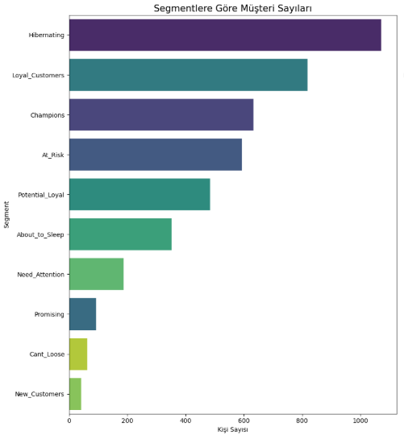
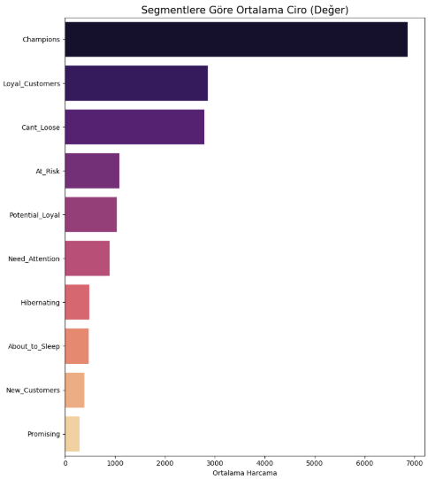

# RFM Analysis & Customer Segmentation: E-Commerce Data 📊


## 📌 Proje Özeti (Business Problem)
Bir e-ticaret şirketi, müşterilerini segmentlere ayırıp pazarlama stratejilerini bu segmentlere göre belirlemek istiyor.
Bu projede, **Online Retail II** veri seti kullanılarak müşterilerin satın alma alışkanlıkları analiz edilmiş ve **RFM (Recency, Frequency, Monetary)** tekniği ile müşteri segmentasyonu gerçekleştirilmiştir.

Amaç:
* Müşteri davranışlarını anlamak.
* "Sadık", "Riskli" ve "Kaybedilen" müşterileri tespit etmek.
* Veriye dayalı aksiyon önerileri geliştirmek.

## 📂 Veri Seti Hikayesi
Veri seti, bir İngiliz perakende şirketinin 01/12/2009 - 09/12/2011 tarihleri arasındaki online satışlarını içermektedir.
* **Kaynağı:** [UCI Machine Learning Repository](https://archive.ics.uci.edu/dataset/502/online+retail+ii)
* **Veri Ön İşleme:**
  * Eksik müşteri ID'leri (%25) veri setinden çıkarıldı.
  * İade faturaları (C ile başlayanlar) temizlendi.
  * Aykırı değerler analiz edilerek filtrelendi.

## 🛠 Kullanılan Teknolojiler
* **Python:** Veri analizi ve manipülasyonu.
* **Pandas & NumPy:** Veri temizleme, filtreleme ve özellik mühendisliği.
* **Matplotlib & Seaborn:** Veri görselleştirme ve içgörü sunumu.

## 🔍 Analiz Süreci (Methodology)
1. **Veri Hazırlığı:**
   * `TotalPrice` (Miktar x Fiyat) metriği oluşturuldu.
   * Null değerler ve negatif tutarlar temizlendi.
2. **RFM Metriklerinin Hesaplanması:**
   * **Recency (Yenilik):** Müşterinin son alışverişinden bugüne geçen süre.
   * **Frequency (Sıklık):** Toplam işlem sayısı.
   * **Monetary (Parasal Değer):** Müşterinin bıraktığı toplam ciro.
3. **Skorlama:**
   * Metrikler 1-5 arasında puanlandı (5 en iyi, 1 en kötü).
   * `RF_SCORE` oluşturuldu.
4. **Segmentasyon:**
   * Müşteriler "Champions", "Loyal Customers", "Hibernating", "At Risk" gibi 10 farklı sınıfa ayrıldı.

## 📊 Önemli Bulgular (Key Findings)

### 1. Segment Dağılımı

* *Grafikte görüldüğü üzere, müşteri tabanının büyük bir kısmı (%26) **"Hibernating"** (Uykuda) segmentindedir.*

### 2. Segmentlerin Ekonomik Değeri

* **Şampiyonlar (Champions):** Sayıca az olmalarına rağmen, ciroya katkıları en yüksek gruptur.
* **Risk Grubu (At Risk):** Bu gruptaki müşterilerin ortalama harcaması, yeni müşterilerden (New Customers) yaklaşık **3 kat daha fazladır**. Bu grubu elde tutmak kritik önem taşır.

## 🚀 Kurulum ve Kullanım

Bu projeyi kendi bilgisayarınızda çalıştırmak için:

1. Repoyu klonlayın:
```bash
git clone [https://github.com/aliapaydin/E-Commerce-RFM-Analysis.git](https://github.com/aliapaydin/E-Commerce-RFM-Analysis.git)